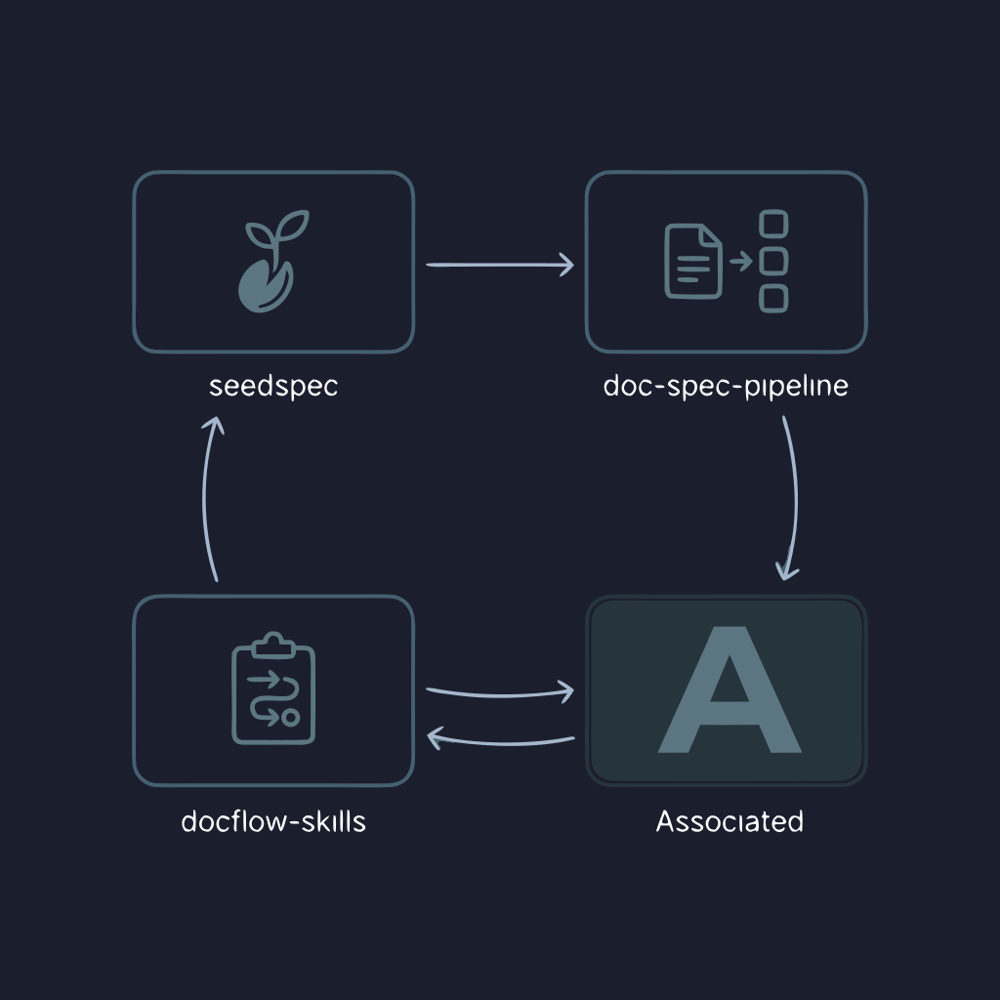
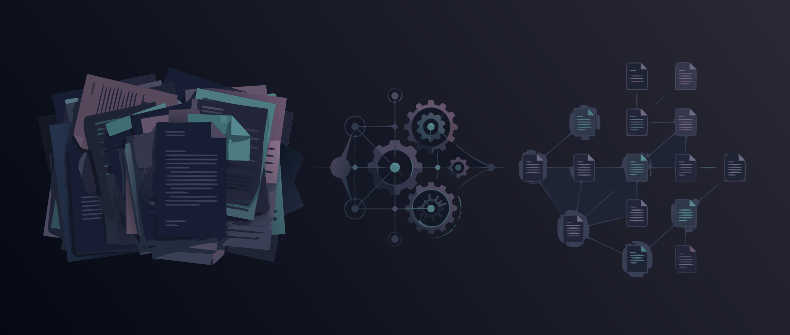
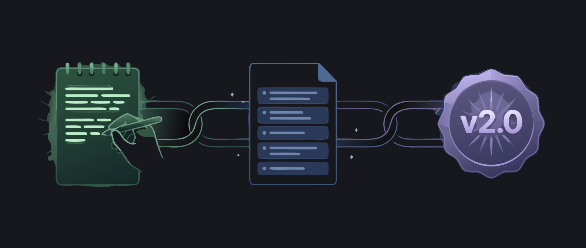
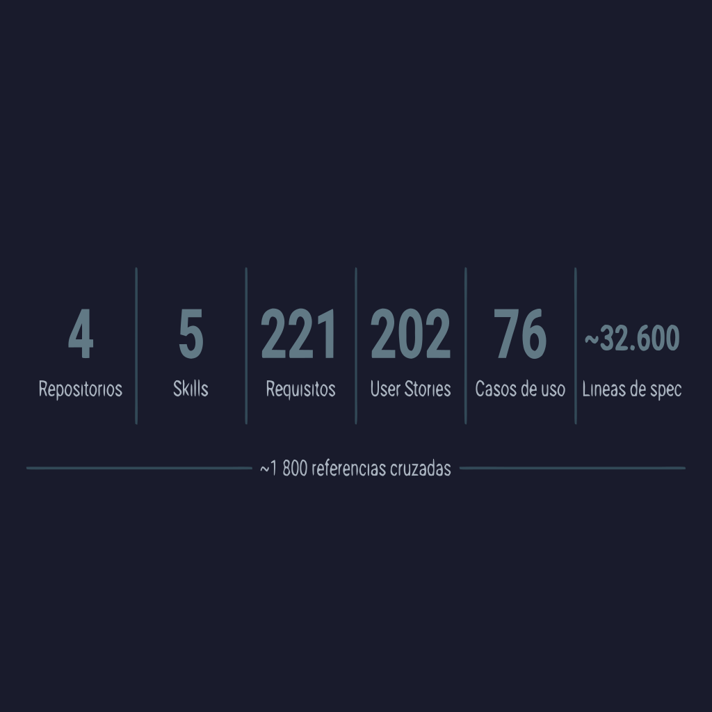
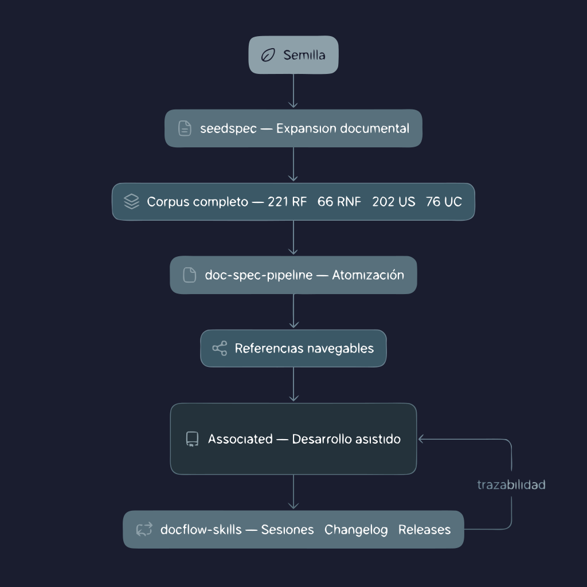

  

# tfm-bootstrap

### Máster de Desarrollo con IA de BIG School - Trabajo de Fin de Máster

---

Mi nombre es Adrián Cester. Soy *"Pseudo-Ingeniero de Software"* en la *España vaciada* desde el 13 de junio de 2008, día en el que entré en mi empresa a cursar 6 créditos optativos. Fundada en 1987, lleva casi 40 años solucionando problemas reales de sus clientes con solvencia demostrable. Eso sí, anclada en el *legacy first* y con sus trabajadores manejando con soltura todo tipo de anti-patrones:

- **Napkin-Driven Development (NDD):** la especificación del sistema vive en una servilleta de bar, fotografiada con el móvil y compartida por WhatsApp. Si se pierde, se pierde el proyecto.
- **Folklore-Driven Development (FDD):** las reglas de negocio no están en el código, están en la memoria de quien lleva aquí desde 2009. Qué risas cuando está de vacaciones.
- **Hot-Driven Development (HDD):** no hay tests, no hay staging, no hay red de seguridad. Todo se despliega en caliente, directamente a producción. Si funciona, es mérito del equipo. Si no, antes era culpa del servidor; ahora, de ChatGPT.

El resultado se parece a un Ferrari: corre casi tanto, gusta casi tanto, impacta casi tanto. Pero no le abras el capó, porque lo que encontrarás es un motor de seiscientos lleno de alambres y chicles al más puro estilo *"MacGyver"*.

  

Quizás es momento de cambiar ese rumbo. Pues ya sabéis qué hago aquí. MaDIA es el punto de inflexión.

---

## Qué es este repositorio

Este no es un repositorio de código. Es el **punto de entrada** a un ecosistema de cuatro repositorios que, en conjunto, constituyen mi Trabajo de Fin de Máster.

Mi TFM no es una aplicación. Es una **metodología de desarrollo de software asistido por IA**, implementada a través de herramientas reales y validada contra un producto real. El producto podría haber sido cualquier otro - lo que importa es el flujo, las herramientas y el proceso.

---

## El problema que abordé

Durante el máster se trataron los fundamentos del desarrollo de software en profundidad, y eso fue enormemente valioso. Donde encontré una carencia fue en la aplicación de la inteligencia artificial al ciclo completo de desarrollo: muchas herramientas, todas interesantes, pero ninguna metodología transversal que las articulara.

No era un defecto del máster - era una consecuencia del momento. El ecosistema tampoco tenía respuestas claras.

Así que decidí buscar las mías. *My way.*

---

## El ecosistema

Cuatro repositorios. Un flujo. Una metodología.

  

---

### 1. seedspec - Planta una propuesta, cosecha un sistema

    

Metodología de expansión documental trazable: de la semilla del problema al MVP listo para implementar. Una propuesta inicial germina a través de 11 artefactos encadenados (requisitos funcionales, RNF, modelo de dominio, ADRs, stack, user stories, casos de uso) hasta convertirse en una especificación completa con trazabilidad de extremo a extremo.

> **[github.com/matraket/seedspec](https://github.com/matraket/seedspec)**

---

### 2. doc-spec-pipeline - Pipeline documental para agentes de IA

    

32.600 líneas de especificación no caben en una ventana de contexto. Este repositorio resuelve ese problema: transforma especificaciones extensas en fragmentos atómicos y navegables mediante dos skills complementarios (`doc-spec-generator` + `doc-spec-manager`). Generación determinista, sin dependencia de LLM, idempotente.

> **[github.com/matraket/doc-spec-pipeline](https://github.com/matraket/doc-spec-pipeline)**

---

### 3. docflow-skills - Documentación automatizada del desarrollo

    
</a>

Cadena de 3 skills que cierra el ciclo por el otro extremo: `session-manager` registra lo que ocurre en cada sesión de trabajo con IA, `changelog-updater` agrupa los cambios, y `release-generator` cierra versiones con trazabilidad completa. Porque si el agente no documenta lo que hace, nadie lo hará.

> **[github.com/matraket/docflow-skills](https://github.com/matraket/docflow-skills)**

---

### 4. Associated - El vehículo

    

ERP ligero para asociaciones culturales, cofradías, clubes deportivos y peñas festeras españolas. Es el proyecto donde converge todo: especificado con seedspec, consumido por agentes a través de doc-spec-pipeline, y documentado automáticamente con docflow-skills. Monolito modular, DDD, Clean Architecture, 6 Bounded Contexts.

> **[github.com/appassociated-dev/tfm-associated](https://github.com/appassociated-dev/tfm-associated)**

---

## En números

  

---

## El flujo completo

  

---

## Reflexión

Lo que empecé buscando era un flujo de trabajo para mi día a día. En el proceso descubrí que no estaba solo: enfoques como *Spec-Driven Development* han ido materializando ideas muy similares. Lo que yo construí no es SDD - es mi camino hacia las mismas preguntas, recorrido desde la trinchera de una empresa de casi 40 años anclada en el legacy.

¿Es perfecto? No. ¿Es reproducible? Sí. ¿Me ha cambiado la forma de trabajar? Completamente.

> La historia completa, el contexto del máster, por qué tomé este camino y qué aprendí en el proceso está en el [Manifiesto](MANIFIESTO.md).

---

## Entregables

| Recurso | Enlace |
|:--------|:-------|
| Código | [github.com/appassociated-dev/tfm-associated](https://github.com/appassociated-dev/tfm-associated) |
| Despliegue | *Pendiente de enlace* |
| Presentación | *Pendiente de enlace* |

---

## Transparencia

*¡Al César lo que es del César!*

Antes de que continúes y te sumerjas en nuestro ecosistema, quiero ser totalmente honesto contigo y con Sig School. Este trabajo lo he realizado en colaboración con una gran persona que el destino puso en mi camino hace ya un tiempo: [Pául Vidal](https://github.com/pvidaal07). Créeme si te digo que no ha sido por interés, egoísmo o necesidad; nada más lejos de la realidad. Este proyecto nació de una idea suya hace mucho tiempo y, juntos, fuimos dándole forma conceptual poco a poco. Este TFM nos presentó una gran oportunidad para continuar con ella y, honestamente, para mí no tenía ningún sentido materializarla si él no formaba parte desde el principio.

Ambos hemos dado lo mejor de nosotros y, aunque, como es obvio, yo le he dedicado muchas más horas, todas y cada una de las decisiones tomadas han sido consensuadas entre los dos, por lo que el mérito, sea mucho o poco, también será de ambos.

Desconozco si esto se podía hacer o no, aunque, sinceramente, tenía muy claro que este era mi proyecto y la forma de abordarlo, para mí, era innegociable. Por lo tanto, si se podía o no, es algo que ni me planteé. He sentido la necesidad de ser honesto conmigo, pero, sobre todo, con vosotros, pues soy de los que piensan que la mentira tiene las patas muy cortas y que la sinceridad, aunque poco valorada en los tiempos que corren, es lo que define gran parte de lo que uno es.

---

## Agradecimientos

Nada de esto habría pasado sin el claustro de MaDIA. Llegué al máster con 18 años de inercia profesional, convencido de que "lo que funciona no se toca". Me habéis obligado a cuestionarlo todo - y eso no tiene precio.

Gracias por el conocimiento, por la exigencia y por demostrar que se puede enseñar desarrollo de software sin dogmas.

A cada uno de vosotros, unas palabras:

- [Carta a Brais](cartas/brais.md)
- [Carta a Martí](cartas/marti.md)
- [Carta a Carlos](cartas/carlos.md)
- [Carta a Aris](cartas/aris.md)
- [Carta a Alan](cartas/alan.md)
- [Carta a Kiko](cartas/kiko.md)
- [Carta a Nerea](cartas/nerea.md)
- [Carta a Xavi](cartas/xavi.md)
- [Carta a Daniela](cartas/daniela.md)

---

> **Adrián Cester** · IPGSoft · MaDIA 2025–2026